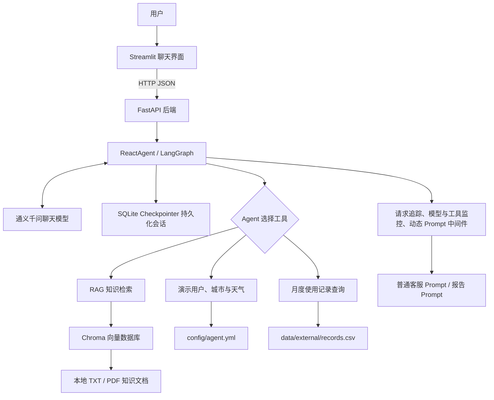

# 智扫通：基于 Agent 与 RAG 的机器人智能客服

[](https://github.com/Wan1ngLunar/smart-cleaning-agent-rag/actions/workflows/ci.yml)

智扫通是一个面向扫地机器人的智能客服项目，基于 FastAPI、Streamlit、LangChain、LangGraph 和 Chroma 构建。系统能够调用知识库检索、演示天气、用户信息和设备使用记录等工具，并支持多轮对话与个性化使用报告生成。

> 本项目用于技术学习和功能演示。用户身份、地理位置、天气及设备记录均为本地演示数据，不代表真实业务系统或实时接口。

## 核心能力

- **RAG 知识库问答**：检索本地 TXT、PDF 文档，生成带行内编号和文件来源的回答。
- **混合拒答机制**：先过滤明显低分片段，再由 System 级知识边界判断资料是否真正足以回答，避免把相似知识迁移到错误设备或时效场景。
- **可量化检索评估**：使用36条正例和24条困难负例计算 Hit@1、Hit@3、MRR 和分数重叠，并提供真实模型冒烟与60条全量验收脚本。
- **混合检索实验**：提供中文双字分词、BM25召回、RRF融合和30组参数搜索；当前作为离线候选召回实验，等待重排序完成后再接入生产问答链路。
- **Agent 工具调用**：根据问题自动选择知识检索、天气、用户信息和使用记录工具。
- **前后端解耦**：Streamlit通过HTTPX调用FastAPI，不直接导入Agent、模型、向量库或SQLite；后端提供聊天、历史和健康检查接口。
- **持久化多轮记忆**：使用 LangGraph SQLite Checkpointer 保存会话状态，以 URL 中的 UUID 隔离会话并支持应用重启恢复。
- **个性化报告生成**：根据本地 CSV 中的设备使用记录生成月度报告和保养建议。
- **确定性演示数据**：固定演示用户和城市，避免随机数据导致结果不可复现。
- **容器化交付**：使用同一非root镜像运行独立的FastAPI与Streamlit容器，提供服务依赖、双健康检查、后端密钥注入及数据库与日志持久化挂载。
- **请求级可观测性**：使用问题编号关联Agent、模型和工具调用，记录成功、失败及耗时，同时避免日志保存用户问题、工具参数和完整会话标识。
- **友好错误处理**：服务端保留带问题编号的异常堆栈，Streamlit页面只展示安全提示，不向用户暴露SDK、文件路径和内部调用栈。
- **工程化保障**：提供环境变量管理、自动化测试、覆盖率统计和 Ruff 静态检查。

## 技术栈

| 分类 | 技术 |
| --- | --- |
| Web 前端 | Streamlit、HTTPX |
| 后端 API | FastAPI、Uvicorn |
| Agent 编排 | LangChain、LangGraph |
| 大语言模型 | 通义千问、langchain-openai、DashScope OpenAI 兼容接口 |
| Embedding 模型 | text-embedding-v4（1024维） |
| 向量数据库 | Chroma（HNSW 余弦距离） |
| 会话持久化 | LangGraph SQLite Checkpointer |
| 数据与配置 | CSV、YAML、python-dotenv |
| 容器化 | Docker、Docker Compose |
| 测试与质量 | pytest、pytest-cov、Ruff |

## 系统架构



## 请求处理流程

1. Streamlit校验URL中的UUID `thread_id`；参数缺失或非法时创建新会话并写回地址栏。
2. 前端使用HTTPX调用FastAPI历史接口；后端校验UUID4后，通过共享ReactAgent从SQLite读取状态，并只返回用户消息和最终助手文本。
3. FastAPI在应用启动时创建一次ReactAgent并保存到应用状态，关闭时通过生命周期钩子释放SQLite连接。
4. 聊天接口校验会话ID、非空问题和4000字符上限，再把请求交给Agent；每次执行生成12位问题编号并记录模型、工具与整体耗时。
5. Agent将用户问题交给模型，由模型判断是否需要调用工具；知识问答场景检索Chroma并过滤低于最低相关性分数的片段。
6. 通过低分过滤后，System消息约束模型核对问题对象、范围和时效；资料不足时统一拒答，资料充分时生成带编号引用的回答并追加文件名和PDF页码。
7. 报告场景读取本地CSV演示记录，并通过中间件切换到报告专用Prompt。
8. FastAPI将最终有效回答包装为JSON；Streamlit只负责展示和本地打字效果。Agent失败时API返回502、安全说明和问题编号，不暴露内部调用栈。

## 项目结构

```text
.
├─ agent/                 # Agent 编排、工具和中间件
├─ backend/               # FastAPI应用、数据契约、依赖与版本化路由
├─ config/                # Agent、RAG、Chroma 等非敏感配置
├─ data/                  # 本地知识文档和演示使用记录
├─ evaluation/            # 检索用例、离线指标和真实模型可回答性评估
├─ frontend/              # Streamlit使用的HTTP客户端和后端地址配置
├─ model/                 # 聊天模型与 Embedding 模型工厂
├─ prompts/               # 普通问答、RAG 总结和报告 Prompt
├─ rag/                   # 文档切分、向量入库和检索服务
├─ tests/                 # 自动化测试与文本编码守卫
├─ utils/                 # 配置、文件、日志、路径和 Prompt 工具
├─ app.py                 # 只通过HTTP访问后端的Streamlit入口
├─ Dockerfile             # FastAPI与Streamlit共用的非root运行镜像
├─ compose.yml            # api/web双服务、健康检查和安全边界编排
├─ .dockerignore          # 排除密钥、虚拟环境和本地运行数据
├─ requirements.txt       # 固定版本的运行依赖
├─ requirements-dev.txt   # 测试与静态检查依赖
├─ pyproject.toml         # pytest、coverage 和 Ruff 配置
├─ .env.example           # 环境变量示例，不包含真实密钥
└─ change.md              # 从原始版本开始的增量改造记录
```

首次运行后生成的 `storage/` 保存 Chroma 数据库、文档 MD5 状态和 SQLite 会话检查点。该目录属于可能包含本地对话的运行产物，已被 Git 忽略，不应提交或公开分享。

## 快速开始

### 1. 准备环境

当前版本在 Python 3.13 环境中完成验证。以下命令在项目根目录执行。

```powershell
# 创建项目专用虚拟环境，避免依赖污染系统 Python。
python -m venv .venv

# 在 PowerShell 中激活虚拟环境。
.\.venv\Scripts\Activate.ps1

# 安装固定版本的项目运行依赖。
python -m pip install -r requirements.txt
```

### 2. 配置模型密钥

```powershell
# 根据安全示例创建只在本机使用的环境变量文件。
Copy-Item -LiteralPath .\.env.example -Destination .\.env
```

打开 `.env`，将占位符替换为自己的 DashScope API Key：

```dotenv
DASHSCOPE_API_KEY=你的真实密钥
```

`.env` 已被 Git 忽略，不应把真实密钥写入 `.env.example`、源码、日志或提交记录。

### 3. 初始化本地知识库

```powershell
# 读取 data 目录中的 TXT 和 PDF，切分文本并写入 Chroma。
python -m rag.vector_store
```

文档内容未变化时，程序会根据 MD5 跳过重复导入。数据库和导入状态统一保存在 `storage/`。

### 4. 启动应用

在第一个终端启动FastAPI：

```powershell
# 启动后端API、Agent和SQLite资源。
python -m uvicorn backend.main:app --host 127.0.0.1 --port 8000
```

在第二个终端启动Streamlit：

```powershell
# 前端通过API_BASE_URL访问FastAPI，不直接创建Agent。
python -m streamlit run app.py
```

FastAPI文档位于`http://127.0.0.1:8000/docs`，聊天页面位于`http://localhost:8501`。页面会把合法的`thread_id`写入URL；使用同一完整URL可以通过后端恢复模型状态和页面聊天历史。点击侧边栏的“新建对话”会生成新UUID、清空页面消息并切换到隔离会话。

URL 中的 UUID 相当于本地会话访问标识。当前演示没有登录和权限校验，不应公开分享包含真实对话的完整 URL。

### 5. 使用 Docker Compose 启动

首次启动前仍需按照第2步在项目根目录创建本地`.env`。Docker构建上下文会通过`.dockerignore`排除真实密钥、虚拟环境、数据库、日志和本地备份；`.env`只在容器运行时注入，不会写入镜像。

```powershell
# 构建镜像并在后台启动应用。
docker compose up --build --detach

# 首次运行或知识文档发生变化时，通过api服务导入宿主机挂载的Chroma目录。
docker compose run --rm api python -m rag.vector_store

# 查看容器是否进入healthy状态。
docker compose ps

# 查看前后端最近日志，不输出本地.env文件内容。
docker compose logs --tail 100 api web
```

启动后访问`http://localhost:8501`，FastAPI文档位于`http://localhost:8000/docs`。只有`api`容器读取`.env`中的模型密钥并挂载`storage/`和`logs/`；`web`容器只获得内部地址`http://api:8000`，不持有模型密钥、Chroma、SQLite或日志目录。重建容器不会删除宿主机上的向量库、会话和日志。

```powershell
# 停止并删除Compose容器和项目网络；宿主机挂载的数据与本地镜像会保留。
docker compose down
```

两个容器均使用普通用户`appuser`运行。Compose先等待FastAPI的`/health`通过，再启动Streamlit，并分别检查后端和页面健康状态。Docker Desktop的镜像下载代理与容器访问模型API的网络路径可能不同；代理应在Docker Desktop或本机网络工具中按环境配置，不应把代理地址、端口或凭据固化到Dockerfile、Compose文件或代码仓库。

### DashScope 连接被重置

如果页面出现 `ConnectionResetError 10054` 或 `Connection aborted`，说明 Python 在建立 DashScope HTTPS 连接时被本地网络或代理中断，并不代表 Chroma、Agent 或 API Key 一定存在问题。

- 检查代理软件的系统代理、TUN 和分流规则；
- 国内网络直连 DashScope 可能比强制经过代理更稳定，具体以本机网络测试为准；
- 修改代理状态后需要停止并重新启动 Streamlit 进程；
- 不要通过关闭 SSL 验证来绕过连接问题；
- 不要把本机代理地址、端口或凭据写入仓库配置。

### 使用问题编号排查失败请求

模型、工具或网络异常时，页面只显示安全提示和12位问题编号，例如：

```text
请求处理暂时失败，请稍后重试。问题编号：a1b2c3d4e5f6
```

开发者可以在本地或容器日志中按编号定位同一次请求：

```powershell
# 在Compose日志中查找指定问题编号关联的Agent、模型和工具记录。
docker compose logs api |
  Select-String "request_id=a1b2c3d4e5f6"
```

正常日志会记录请求开始、成功或失败、模型与工具名称、消息数量和毫秒耗时。日志不会主动保存用户完整问题、工具参数、完整`thread_id`或API Key。服务端失败日志包含开发排查所需的异常类型和调用栈，但这些内部信息不会显示在Streamlit页面。

## 质量检查

开发环境安装：

```powershell
# 在运行依赖基础上安装 pytest、pytest-cov 和 Ruff。
python -m pip install -r requirements-dev.txt
```

提交代码前建议依次执行：

```powershell
# 检查明显语法错误、未定义名称和导入顺序。
python -m ruff check .

# 运行全部自动化测试。
python -m pytest -q

# 按pyproject.toml统计Agent、后端和前端客户端，并执行与CI相同的60%门禁。
python -m pytest --cov --cov-report=term-missing --cov-fail-under=60 -q
```

当前基线为102项测试通过，Agent、FastAPI后端、HTTP前端客户端及核心模块总覆盖率为83.56%。测试覆盖API数据契约、生命周期、健康检查、聊天与历史路由、安全错误、HTTP连接异常、前后端导入边界、容器服务与密钥隔离，以及RAG、BM25、RRF融合、参数调优、SQLite会话、请求追踪和60条评测集守卫。开发测试使用`httpx2`适配当前Starlette TestClient，生产前端继续使用固定版本`httpx`，完整测试不产生对应的弃用警告。

## RAG 评估

检索评估用例保存在 `evaluation/retrieval_cases.yml`，当前包含36条正例和24条负例，共60条。正例覆盖6份知识文档中的选购参数、维护周期、拖地功能、故障排查和技术原理；负例覆盖实时与外部数据、相邻清洁设备、内部元器件级维修、程序开发、固件逆向、法律结论和医疗建议等知识边界。

```powershell
# 查询真实Chroma并计算Hit@1、Hit@3、MRR和正负例分数边界。
python -m evaluation.evaluate_retrieval

# 使用已选参数对比纯向量与BM25加RRF混合检索。
python -m evaluation.compare_retrieval

# 缓存一次候选并搜索30组混合检索参数，输出推荐配置。
python -m evaluation.tune_hybrid_retrieval

# 使用真实模型快速验证正常回答、低分拒答和高分范围拒答。
python -m evaluation.evaluate_answerability

# 使用真实模型运行YAML中的全部60条可回答性用例。
python -m evaluation.evaluate_answerability --all
```

当前Chroma集合显式使用HNSW余弦距离。60条来源级检索基线为Hit@1 80.56%、Hit@3 94.44%、MRR 0.8750；正例最低Top-1分数为0.6322，负例最高Top-1分数为0.7608，分数间隔为-0.1286。正负例分数仍然重叠，证明单一相似度阈值无法可靠判断是否可回答。因此系统采用两层机制：`0.20`仅作为明显无关片段的粗过滤门槛，高分结果继续由System级知识范围和资料充分性规则判断。

离线混合检索使用中文双字词元BM25补充余弦向量召回，再通过Chroma文档ID执行RRF去重融合。对向量候选`10/20`、BM25候选`5/10/20`和RRF常数`1/5/10/30/60`进行30组网格搜索后，推荐配置为向量候选10、BM25候选20、RRF常数10。人工复核并补全一个有效来源标注后，36条正例的Hit@1由80.56%提升到88.89%，Hit@3由94.44%提升到97.22%，MRR由0.8750提升到0.9306。该模块目前用于离线候选召回实验，生产RAG仍保留原Top-3向量检索，待重排序完成后统一接入。

同一批1024维归一化向量从Chroma默认L2迁移到显式余弦距离后，Hit@1、Hit@3和MRR保持不变，相关性分数警告数量由有变为0。迁移前的L2索引已保存在本地忽略目录中，当前余弦索引由6份知识文件重新生成，共326个向量和6条MD5导入记录。

真实模型冒烟评估为3/3通过，历史60条全量端到端基线为59/60通过：35/36条正例正常回答并附带来源，24/24条负例全部拒答。唯一失败用例`low_battery_immediate_recharge`的20%直接证据原本未进入向量Top-10；加入BM25后已提升到关键词第1，但在RRF结果中仍排第6。另一个完整HEPA维护周期片段位于融合第4。这两个样本将用于下一阶段重排序验收，不通过放宽拒答规则规避。上述真实评测会访问Chroma和DashScope，不属于默认CI，运行前需要有效API Key，并会产生API用量。

## 持续集成

仓库提供 [`.github/workflows/ci.yml`](.github/workflows/ci.yml)。推送到 `master` 或 `main`、创建或更新 Pull Request 时，GitHub Actions 会自动：

1. 在 Ubuntu 环境中安装 Python 3.13；
2. 根据依赖文件缓存并安装开发依赖；
3. 运行 Ruff 静态检查；
4. 运行全部测试和覆盖率统计；
5. 在覆盖率低于 60% 时阻止检查通过。

CI 使用测试专用的 DashScope 占位值，不保存真实 API Key，也不会在现有测试中调用真实聊天或 Embedding 服务。工作流已在 GitHub 的 Ubuntu Runner 中完成首次在线验证，状态为 Success。

## 可复现的演示场景

可以在页面中依次尝试：

1. `小户型应该如何选择扫地机器人？请给出知识库来源。`
2. `深圳现在的演示天气是什么？请说明数据是否实时。`
3. `我家面积是68平方米，并且养了两只猫。`
4. `请复述我刚才提供的家庭信息。`
5. `生成用户1001在2025-06的使用报告。`
6. 点击“新建对话”，再询问第4个问题，验证新旧会话隔离。
7. 复制当前完整URL，停止并重新启动Streamlit，再打开该URL验证聊天历史和模型记忆恢复。
8. 点击“新建对话”确认URL中的UUID变化，再打开旧URL验证旧会话仍可恢复。

这些场景分别覆盖带来源的 RAG 检索、演示工具、持久化多轮记忆、报告生成、会话隔离和跨应用重启恢复。RAG 回答末尾应显示去重后的文件名，PDF 来源还应显示页码。

## 关键工程设计

- **路径稳定性**：Chroma 和 MD5 路径先转换为项目绝对路径，避免从不同目录启动时生成多份数据库。
- **幂等导入**：文档写入 Chroma 成功后才保存 MD5，失败任务可以在下次启动时重试。
- **持久化会话**：模型状态按`thread_id`写入SQLite；URL保留UUID，应用重启后可重新定位并恢复同一会话。
- **API边界**：Streamlit只依赖HTTP客户端；FastAPI使用UUID4、Pydantic严格字段和响应模型约束输入输出，版本化路由为后续演进保留空间。
- **状态一致性**：页面历史通过FastAPI从LangGraph状态重建，只展示用户消息和最终AI文本；新建对话同步更新URL、后端会话键和页面消息。
- **连接生命周期**：后端进程复用一个ReactAgent和SQLite连接，并在FastAPI生命周期结束时关闭；每个浏览器会话复用独立HTTPX连接池。
- **安全反序列化**：Checkpoint只允许LangGraph内置安全类型白名单，白名单外对象不会被重新实例化。
- **数据一致性**：CSV 按表头读取并校验必要列、空记录和重复用户月份，再一次性发布到进程缓存。
- **来源可追溯**：模型上下文使用稳定编号，服务层根据文档元数据追加文件名和 PDF 页码，不依赖模型自行生成来源。
- **空检索保护**：没有有效知识片段时直接返回明确说明，不调用模型编造答案或产生额外费用。
- **混合拒答**：低相关性粗过滤减少无效模型调用；高分结果由 System 级设备范围、问题对象和时效规则继续判断，资料不足时不附加误导性来源。
- **评估可回归**：固定 YAML 用例同时衡量正确来源排名和无答案行为；离线指标计算不依赖真实模型，真实可回答性评估可按冒烟或全量模式运行。
- **距离度量明确**：文本向量集合显式使用HNSW余弦距离，启动时校验配置值；度量变更后重建索引，避免依赖Chroma默认L2和混用旧集合。
- **混合召回可复现**：BM25与向量候选通过文档ID执行RRF融合，独立调优脚本缓存一次远程候选并比较30组参数，生产配置保存人工核验后的推荐值。
- **安全配置**：模型密钥从环境变量加载；系统环境变量优先于本地 `.env`，缺失时快速失败并给出修复提示。
- **模型集成兼容**：聊天与向量模型通过DashScope官方OpenAI兼容接口接入；向量维度固定为1024，批量大小限制为10，与现有Chroma索引及`text-embedding-v4`接口约束保持一致。
- **轻量文件加载**：TXT由Python标准库按UTF-8读取，PDF由`pypdf`按页解析，并保留来源路径、内部页索引和展示页码，不再依赖Community加载器。
- **容器安全**：构建上下文排除密钥与本地产物，api/web均以无登录权限的普通用户运行；只有api注入模型密钥，健康检查不调用模型API。
- **容器持久化**：只有api挂载Chroma、SQLite和日志目录；web无权直接访问运行数据，容器重建后仍可恢复知识索引与历史会话。
- **安全错误传递**：FastAPI将Agent异常转换为带问题编号的502 JSON；HTTP客户端不把未知响应正文、连接栈或内部HTML错误页展示给用户。
- **请求关联**：每次提问生成独立问题编号，Agent、模型和工具日志共享该编号，并分别记录调用结果和耗时。
- **日志最小化**：日志只保存排障所需的编号、阶段、数量、异常类型和耗时，不主动记录问题正文、工具参数、完整会话ID或密钥。
- **错误边界**：Agent边界记录真实异常并转换为安全错误；页面只显示问题编号，避免将SDK调用栈、内部路径和网络细节暴露给用户。
- **演示边界**：固定用户、城市和天气均明确标注为演示数据，不冒充真实业务接口。
- **自动化守卫**：测试覆盖关键配置、路径、工具、CSV、文件边界和 UTF-8 文本规范。

## 当前限制

- SQLite持久化适合本地演示和单机工作流；多实例生产部署仍应迁移到PostgreSQL等服务化存储。
- URL中的UUID尚未绑定登录用户，知道完整URL的人可能访问对应本地会话；公开部署前必须增加身份认证、授权和会话过期机制。
- 天气、用户身份和设备记录来自本地演示配置，不是实时外部服务。
- Chroma 使用本地持久化目录，暂未提供独立向量数据库服务。
- 当前评估集为60条人工设计用例，已经覆盖主要知识主题和困难边界，但仍不能代表所有真实用户问题；真实模型判断还可能随模型版本变化。
- 当前检索指标按预期来源文件统计，可能出现“文件名正确但片段不含答案”的来源级命中；混合召回已找回低电量直接证据，但仍需通过重排序和片段级证据指标验证最终Top-3质量。
- 当前容器配置面向本地单机演示，尚未提供用户登录、权限隔离、限流、监控告警、TLS入口和多实例生产编排。
- 当前可观测性基于本地文本日志和问题编号，尚未接入集中式日志、指标系统、分布式追踪和自动告警。
- 当前聊天接口返回完整JSON回答，Streamlit的逐字效果属于前端展示；尚未实现SSE或NDJSON形式的HTTP增量流式传输。

## 后续计划

- 增加会话列表、标题、删除和过期清理，并为公开部署加入登录与访问控制。
- 将单机SQLite Checkpointer迁移为适合多实例部署的PostgreSQL后端。
- 将评测集继续扩充到100条左右，引入真实问法，并增加片段级证据命中、引用准确率、工具路由成功率、P95响应时间和单次请求成本指标。
- 在已完成的BM25与RRF候选召回基础上增加重排序，再评估查询改写，并继续使用同一评测集进行消融对比。
- 评估结构化可回答性分类，进一步降低对生成模型边界判断的依赖。
- 为浏览器交互补充自动化端到端测试，并评估SSE或NDJSON流式回答。
- 将本地请求日志接入集中式日志与指标平台，并建立延迟、错误率和工具失败告警。
- 增加公开部署所需的身份认证、TLS入口、监控告警和多实例编排。

## 改造记录

项目从原始版本开始的每项问题、修改内容、设计意义和验证结果均记录在 [`change.md`](change.md)。
