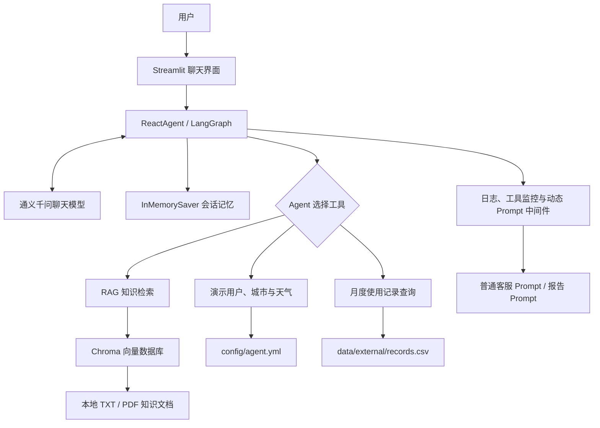

# 智扫通：基于 Agent 与 RAG 的机器人智能客服

[](https://github.com/Wan1ngLunar/smart-cleaning-agent-rag/actions/workflows/ci.yml)

智扫通是一个面向扫地机器人的智能客服项目，基于 LangChain、LangGraph、Chroma 和 Streamlit 构建。系统能够调用知识库检索、演示天气、用户信息和设备使用记录等工具，并支持多轮对话与个性化使用报告生成。

> 本项目用于技术学习和功能演示。用户身份、地理位置、天气及设备记录均为本地演示数据，不代表真实业务系统或实时接口。

## 核心能力

- **RAG 知识库问答**：检索本地 TXT、PDF 文档，生成带行内编号和文件来源的回答。
- **混合拒答机制**：先过滤明显低分片段，再由 System 级知识边界判断资料是否真正足以回答，避免把相似知识迁移到错误设备或时效场景。
- **可量化检索评估**：使用固定正负例计算 Hit@1、Hit@3、MRR 和分数重叠，并提供真实模型冒烟与全量验收脚本。
- **Agent 工具调用**：根据问题自动选择知识检索、天气、用户信息和使用记录工具。
- **多轮会话记忆**：使用 LangGraph Checkpointer 和 `thread_id` 隔离不同会话。
- **个性化报告生成**：根据本地 CSV 中的设备使用记录生成月度报告和保养建议。
- **确定性演示数据**：固定演示用户和城市，避免随机数据导致结果不可复现。
- **工程化保障**：提供环境变量管理、自动化测试、覆盖率统计和 Ruff 静态检查。

## 技术栈

| 分类 | 技术 |
| --- | --- |
| Web 界面 | Streamlit |
| Agent 编排 | LangChain、LangGraph |
| 大语言模型 | 通义千问 |
| Embedding 模型 | DashScope Text Embedding |
| 向量数据库 | Chroma |
| 数据与配置 | CSV、YAML、python-dotenv |
| 测试与质量 | pytest、pytest-cov、Ruff |

## 系统架构



## 请求处理流程

1. Streamlit 接收用户问题，并为当前页面会话维护唯一的 `thread_id`。
2. LangGraph 根据 `thread_id` 恢复当前会话的历史消息，实现多轮对话。
3. Agent 将用户问题交给模型，由模型判断是否需要调用工具。
4. 知识问答场景会检索 Chroma 中的本地文档，并在生成前过滤低于最低相关性分数的片段。
5. 通过低分过滤后，System 消息会约束模型核对问题对象、范围和时效；资料不足时返回统一拒答，资料充分时生成带编号引用的回答，再由服务层追加去重后的文件名和 PDF 页码。
6. 报告场景会读取本地 CSV 演示记录，并通过中间件切换到报告专用 Prompt。
7. Agent 的最终结果以流式方式返回 Streamlit 页面。

## 项目结构

```text
.
├─ agent/                 # Agent 编排、工具和中间件
├─ config/                # Agent、RAG、Chroma 等非敏感配置
├─ data/                  # 本地知识文档和演示使用记录
├─ evaluation/            # 检索用例、离线指标和真实模型可回答性评估
├─ model/                 # 聊天模型与 Embedding 模型工厂
├─ prompts/               # 普通问答、RAG 总结和报告 Prompt
├─ rag/                   # 文档切分、向量入库和检索服务
├─ tests/                 # 自动化测试与文本编码守卫
├─ utils/                 # 配置、文件、日志、路径和 Prompt 工具
├─ app.py                 # Streamlit 应用入口
├─ requirements.txt       # 固定版本的运行依赖
├─ requirements-dev.txt   # 测试与静态检查依赖
├─ pyproject.toml         # pytest、coverage 和 Ruff 配置
├─ .env.example           # 环境变量示例，不包含真实密钥
└─ change.md              # 从原始版本开始的增量改造记录
```

首次导入后生成的 `storage/` 保存 Chroma 数据库和文档 MD5 状态。该目录属于本地运行产物，已被 Git 忽略。

## 快速开始

### 1. 准备环境

当前版本在 Python 3.13 环境中完成验证。以下命令在项目根目录执行。

```powershell
# 创建项目专用虚拟环境，避免依赖污染系统 Python。
python -m venv .venv

# 在 PowerShell 中激活虚拟环境。
.\.venv\Scripts\Activate.ps1

# 安装固定版本的项目运行依赖。
python -m pip install -r requirements.txt
```

### 2. 配置模型密钥

```powershell
# 根据安全示例创建只在本机使用的环境变量文件。
Copy-Item -LiteralPath .\.env.example -Destination .\.env
```

打开 `.env`，将占位符替换为自己的 DashScope API Key：

```dotenv
DASHSCOPE_API_KEY=你的真实密钥
```

`.env` 已被 Git 忽略，不应把真实密钥写入 `.env.example`、源码、日志或提交记录。

### 3. 初始化本地知识库

```powershell
# 读取 data 目录中的 TXT 和 PDF，切分文本并写入 Chroma。
python -m rag.vector_store
```

文档内容未变化时，程序会根据 MD5 跳过重复导入。数据库和导入状态统一保存在 `storage/`。

### 4. 启动应用

```powershell
# 从项目根目录启动 Streamlit 聊天页面。
python -m streamlit run app.py
```

启动后访问终端显示的本地地址。点击侧边栏的“新建对话”会清空页面消息并创建新的 `thread_id`。

### DashScope 连接被重置

如果页面出现 `ConnectionResetError 10054` 或 `Connection aborted`，说明 Python 在建立 DashScope HTTPS 连接时被本地网络或代理中断，并不代表 Chroma、Agent 或 API Key 一定存在问题。

- 检查代理软件的系统代理、TUN 和分流规则；
- 国内网络直连 DashScope 可能比强制经过代理更稳定，具体以本机网络测试为准；
- 修改代理状态后需要停止并重新启动 Streamlit 进程；
- 不要通过关闭 SSL 验证来绕过连接问题；
- 不要把本机代理地址、端口或凭据写入仓库配置。

## 质量检查

开发环境安装：

```powershell
# 在运行依赖基础上安装 pytest、pytest-cov 和 Ruff。
python -m pip install -r requirements-dev.txt
```

提交代码前建议依次执行：

```powershell
# 检查明显语法错误、未定义名称和导入顺序。
python -m ruff check .

# 运行全部自动化测试。
python -m pytest -q

# 运行核心模块覆盖率并执行与CI相同的60%门禁。
python -m pytest --cov=agent --cov=model --cov=rag --cov=utils --cov-report=term-missing --cov-fail-under=60 -q
```

当前基线为 25 项测试通过，核心模块测试覆盖率为 67.25%。测试覆盖来源去重、PDF 页码、低分过滤、资料不足拒答、System/Human 消息分层、检索指标和评估模式选择。现有一条 `langchain-community` 弃用警告，已记录为后续依赖迁移事项，没有通过过滤规则隐藏。

## RAG 评估

检索评估用例保存在 `evaluation/retrieval_cases.yml`，当前包含 6 条正例和 8 条负例。负例既包含炒菜、股票等简单跨领域问题，也包含实时价格、具体型号、手持吸尘器和工业机器人等语义相近但知识范围不匹配的困难问题。

```powershell
# 查询真实Chroma并计算Hit@1、Hit@3、MRR和正负例分数边界。
python -m evaluation.evaluate_retrieval

# 使用真实模型快速验证正常回答、低分拒答和高分范围拒答。
python -m evaluation.evaluate_answerability

# 使用真实模型运行YAML中的全部14条可回答性用例。
python -m evaluation.evaluate_answerability --all
```

真实检索基线为 Hit@1 100%、Hit@3 100%、MRR 1.0。困难负例最高 Top-1 分数为 0.6617，高于正例最低分 0.4798，证明单一相似度阈值无法可靠判断是否可回答。因此系统采用两层机制：`0.20` 仅作为明显无关片段的粗过滤门槛，高分结果继续由 System 级知识范围和资料充分性规则判断。

真实模型冒烟评估为 3/3 通过，全量评估为 14/14 通过。上述命令会调用真实 Chroma 和 DashScope，不属于默认 CI，运行前需要配置有效 API Key，并会产生少量 API 用量。

## 持续集成

仓库提供 [`.github/workflows/ci.yml`](.github/workflows/ci.yml)。推送到 `master` 或 `main`、创建或更新 Pull Request 时，GitHub Actions 会自动：

1. 在 Ubuntu 环境中安装 Python 3.13；
2. 根据依赖文件缓存并安装开发依赖；
3. 运行 Ruff 静态检查；
4. 运行全部测试和覆盖率统计；
5. 在覆盖率低于 60% 时阻止检查通过。

CI 使用测试专用的 DashScope 占位值，不保存真实 API Key，也不会在现有测试中调用真实聊天或 Embedding 服务。工作流已在 GitHub 的 Ubuntu Runner 中完成首次在线验证，状态为 Success。

## 可复现的演示场景

可以在页面中依次尝试：

1. `小户型应该如何选择扫地机器人？请给出知识库来源。`
2. `深圳现在的演示天气是什么？请说明数据是否实时。`
3. `我家面积是68平方米，并且养了两只猫。`
4. `请复述我刚才提供的家庭信息。`
5. `生成用户1001在2025-06的使用报告。`
6. 点击“新建对话”，再询问第4个问题，验证新旧会话隔离。

这些场景分别覆盖带来源的 RAG 检索、演示工具、多轮记忆、报告生成和会话隔离。RAG 回答末尾应显示去重后的文件名，PDF 来源还应显示页码。

## 关键工程设计

- **路径稳定性**：Chroma 和 MD5 路径先转换为项目绝对路径，避免从不同目录启动时生成多份数据库。
- **幂等导入**：文档写入 Chroma 成功后才保存 MD5，失败任务可以在下次启动时重试。
- **会话隔离**：模型历史按 `thread_id` 保存，页面展示状态与模型记忆同步重置。
- **数据一致性**：CSV 按表头读取并校验必要列、空记录和重复用户月份，再一次性发布到进程缓存。
- **来源可追溯**：模型上下文使用稳定编号，服务层根据文档元数据追加文件名和 PDF 页码，不依赖模型自行生成来源。
- **空检索保护**：没有有效知识片段时直接返回明确说明，不调用模型编造答案或产生额外费用。
- **混合拒答**：低相关性粗过滤减少无效模型调用；高分结果由 System 级设备范围、问题对象和时效规则继续判断，资料不足时不附加误导性来源。
- **评估可回归**：固定 YAML 用例同时衡量正确来源排名和无答案行为；离线指标计算不依赖真实模型，真实可回答性评估可按冒烟或全量模式运行。
- **安全配置**：模型密钥从环境变量加载；系统环境变量优先于本地 `.env`，缺失时快速失败并给出修复提示。
- **演示边界**：固定用户、城市和天气均明确标注为演示数据，不冒充真实业务接口。
- **自动化守卫**：测试覆盖关键配置、路径、工具、CSV、文件边界和 UTF-8 文本规范。

## 当前限制

- 会话历史保存在进程内存中，应用重启后不会保留。
- 天气、用户身份和设备记录来自本地演示配置，不是实时外部服务。
- Chroma 使用本地持久化目录，暂未提供独立向量数据库服务。
- 当前评估集为 14 条人工设计用例，能够建立回归基线，但不能代表所有真实用户问题；真实模型判断还可能随模型版本变化。
- 当前没有用户登录、权限隔离、限流、监控告警和生产部署配置。
- `langchain-community` 中的通义模型集成已提示弃用，后续需要迁移到独立维护的集成包。

## 后续计划

- 将内存会话存储替换为可持久化 Checkpointer。
- 扩充检索评估集，引入更多真实问法、困难负例和持续指标对比。
- 评估重排序或结构化可回答性分类，进一步降低对生成模型边界判断的依赖。
- 为 Agent 流程、中间件和 Streamlit 交互补充自动化测试。
- 增加 Docker 和部署说明。
- 迁移已弃用的模型集成依赖，并验证版本兼容性。

## 改造记录

项目从原始版本开始的每项问题、修改内容、设计意义和验证结果均记录在 [`change.md`](change.md)。
