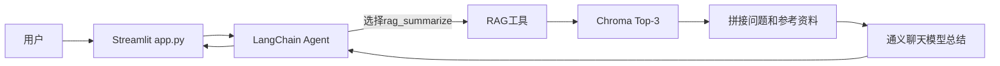
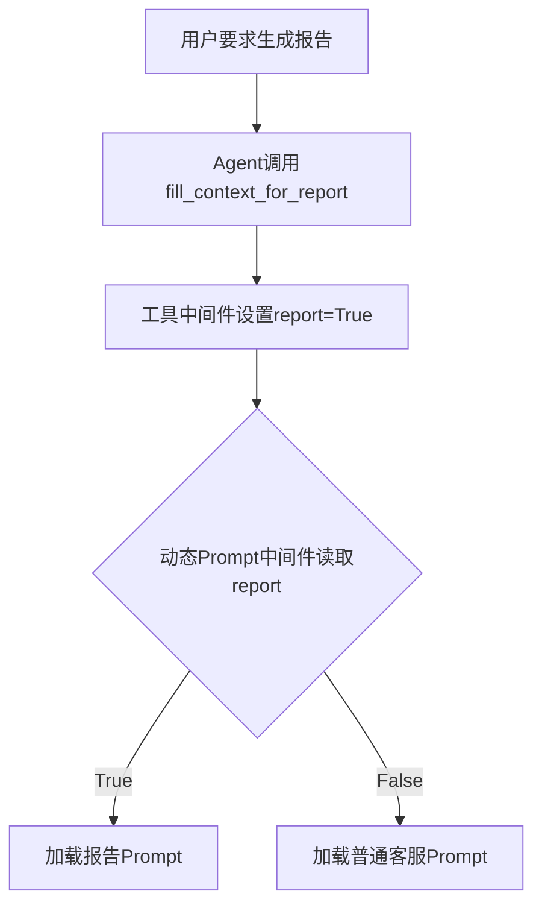
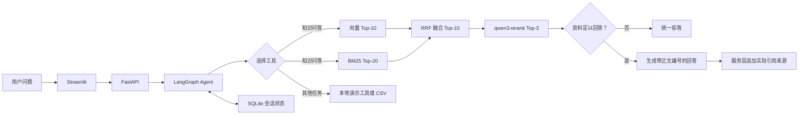

# 智扫通项目优化学习笔记

> 这不是一份要求读者照着命令完整复现的部署手册，而是一份从“能运行的课程项目”走向“可解释、可测试、可演示的实习项目”的学习记录。即使你从未接触过 RAG、Agent、向量数据库或 Docker，也可以先理解其中的问题、设计方法和验证思路。

## 0. 优化前的原项目导读

在学习“怎样优化”之前，必须先看懂原项目已经做了什么。这个项目并不是从空文件开始重写：Git 初始提交 `410d5d8` 已经实现了一个可以运行的扫地机器人 Agent + RAG 课程项目。

原项目的价值是完成了主要功能闭环；后续优化的目标，是让这个闭环变得稳定、可复现、可测试、可追溯和可部署。

### 0.1 原项目要解决什么问题

原项目名为“智扫通机器人智能客服”，面向扫地机器人和扫拖一体机器人场景，提供三类能力：

1. **专业知识问答**：从本地 TXT/PDF 中查找选购、使用、维护和故障资料，再让模型总结回答；
2. **环境和用户上下文**：通过工具获取天气、用户城市、用户 ID 和月份；
3. **使用报告生成**：读取本地 CSV 中某个用户、某个月份的清洁效率和耗材记录，切换专用 Prompt 生成报告。

它已经体现了一个 Agent 项目的基本思想：模型不只生成文本，还能根据任务选择工具，并在获得工具结果后继续推理。

### 0.2 原项目的目录和各文件职责

初始提交没有 FastAPI、Docker、测试、评测和 README，核心目录如下：

```text
.
├─ agent/
│  ├─ react_agent.py          # 创建Agent、注册工具和中间件
│  └─ tools/
│     ├─ agent_tools.py       # RAG、天气、用户和报告数据工具
│     └─ middleware.py        # 工具监控、模型日志和Prompt切换
├─ config/
│  ├─ agent.yml              # CSV数据路径
│  ├─ chroma.yml             # Chroma、切分和文件类型配置
│  ├─ prompts.yml            # 三份Prompt文件的位置
│  └─ rag.yml                # 聊天与Embedding模型名称
├─ data/                     # 6份知识文档和1份CSV演示记录
├─ model/factory.py          # 创建通义聊天模型和Embedding模型
├─ prompts/                  # 主Agent、RAG总结、报告生成Prompt
├─ rag/
│  ├─ vector_store.py        # 文档读取、切分、MD5去重和Chroma检索
│  └─ rag_service.py         # 把检索片段交给聊天模型总结
├─ utils/                    # YAML、文件、日志、路径和Prompt读取工具
└─ app.py                    # Streamlit聊天页面和程序入口
```

理解这个结构时，可以按职责把它分成五层：

| 层次 | 原项目组件 | 主要职责 |
| --- | --- | --- |
| 页面层 | `app.py` | 接收用户输入、展示消息和逐字输出 |
| Agent 层 | `react_agent.py` | 调用聊天模型并决定使用哪个工具 |
| 工具层 | `agent_tools.py` | 连接RAG、天气、用户上下文和CSV记录 |
| RAG 层 | `rag_service.py`、`vector_store.py` | 导入知识、检索Top-3并总结 |
| 基础设施层 | `model/`、`config/`、`utils/` | 创建模型，读取配置、文件和Prompt |

### 0.3 一条普通知识问题原来怎样执行

假设用户输入：

```text
小户型应该怎样选择扫地机器人？
```

原始执行链路如下：

1. `app.py` 从 `st.chat_input()` 获得问题；
2. 页面调用 `ReactAgent.execute_stream(prompt)`；
3. `ReactAgent` 把当前问题交给 LangChain Agent；
4. 聊天模型根据主 Prompt 判断应该调用 `rag_summarize`；
5. `rag_summarize` 调用全局 `RagSummarizeService`；
6. Chroma 根据问题向量取相似度最高的 3 个片段；
7. `RagSummarizeService` 把片段正文和原始元数据拼入 RAG Prompt；
8. 同一个聊天模型根据参考资料生成中文概括；
9. 工具结果回到 Agent，Agent 再生成最终回复；
10. Streamlit 把输出拆成字符，制造逐字显示效果。



这里实际上有两次模型参与：第一次由 Agent 模型决定是否调用工具，第二次由 RAG 总结链阅读检索资料。工具完成后，Agent 还可能再次调用模型生成最终答复。

### 0.4 原来的 Streamlit 页面做了什么

`app.py` 主要依赖 `st.session_state` 保存两个对象：

```text
agent    -> 当前页面会话创建的ReactAgent实例
message  -> 用于页面重新渲染的消息列表
```

页面会先重放 `message` 中的历史，再显示新问题和回复。模型输出通过生成器逐块获取，每个字符暂停约 0.01 秒，从而产生类似流式打字的视觉效果。

但是要注意：

- 页面能显示旧消息，不等于模型拥有多轮记忆；
- `execute_stream()` 每次只把当前用户问题放入新的 `messages`；
- 原 Agent 没有 Checkpointer，也没有把页面历史重新传给模型；
- 页面刷新、服务重启和打开新浏览器后，状态也无法可靠恢复。

因此原项目具备“页面历史展示”，但不具备后来实现的“模型多轮状态持久化”。

### 0.5 原来的 Agent 和 7 个工具

`ReactAgent` 使用 `create_agent()` 注册 7 个工具：

| 工具 | 原始用途 | 原始数据来源 |
| --- | --- | --- |
| `rag_summarize` | 检索专业知识 | Chroma中的本地TXT/PDF |
| `get_weather` | 返回指定城市天气 | 函数内固定天气字符串 |
| `get_user_location` | 获取用户城市 | 深圳、合肥、杭州中随机选择 |
| `get_user_id` | 获取用户ID | 1001～1010中随机选择 |
| `get_current_month` | 获取当前月份 | 2025年12个月中随机选择 |
| `fetch_external_data` | 查询用户月度记录 | 本地CSV |
| `fill_context_for_report` | 标记报告生成场景 | 修改Agent运行时上下文 |

主 Prompt 描述了这些工具的用途，并要求报告场景依次获得用户 ID、月份、填充报告上下文，再查询使用记录。

这里需要区分“工具名称表达的能力”和“工具当时真实做到的能力”。例如：

- Prompt 把天气描述为实时天气，但函数只返回固定数据；
- Prompt 把位置称为用户实际城市，但代码只是随机选择；
- `get_current_month` 名称像真实当前月份，实际却随机返回 2025 年某月；
- `fetch_external_data` 描述为外部系统，实际读取本地 CSV。

后续把这些工具改成确定性演示数据，并明确标注“非实时、非真实身份”，就是为了让接口声明和真实能力一致。

### 0.6 动态报告 Prompt 原来怎样工作

原项目已经实现了一个值得理解的中间件设计：普通客服和报告生成使用不同 Prompt。

流程如下：

1. 每次 Agent 执行时，运行时上下文最初包含 `report=False`；
2. 模型识别报告需求后调用 `fill_context_for_report`；
3. `monitor_tool` 中间件发现这个工具调用成功，把 `report` 改为 `True`；
4. 下一次调用模型前，`report_prompt_switch` 读取该标记；
5. `report=True` 时加载 `report_prompt.txt`，否则加载普通 `main_prompt.txt`。



这说明原项目不只是简单函数调用，已经使用中间件改变 Agent 后续行为。后续优化保留了这一业务思路，同时增加了确定性数据、测试和安全日志。

### 0.7 原来的知识入库流程

`VectorStoreService.load_document()` 已经实现了完整的基础入库步骤：

1. 扫描 `data/` 下允许的 `.txt` 和 `.pdf`；
2. 计算文件 MD5；
3. 如果 MD5 已记录则跳过；
4. 使用 `TextLoader` 或 `PyPDFLoader` 生成 Document；
5. 使用 `RecursiveCharacterTextSplitter` 切分；
6. 调用 Embedding 模型生成向量并写入 Chroma；
7. 写入成功后保存 MD5；
8. 单个文件失败时记录日志，继续处理其他文件。

原始切分配置是：

```yaml
chunk_size: 200
chunk_overlap: 20
k: 3
```

含义是每个文本片段目标长度约 200 个字符，相邻片段重叠 20 个字符，检索时返回 3 个片段。

重叠的作用是减少答案刚好跨越切分边界时的信息丢失。MD5 的作用是避免每次运行都把同一文件重复写入数据库。

### 0.8 原来的 RAG 总结链

原 RAG 服务使用 LangChain 表达式把几个组件串起来：

```text
PromptTemplate -> 打印完整Prompt -> ChatTongyi -> StrOutputParser
```

其中：

- `PromptTemplate` 把 `{input}` 和 `{context}` 填入模板；
- `print_prompt` 把完整问题和检索正文打印到终端；
- `ChatTongyi` 调用聊天模型；
- `StrOutputParser` 把模型消息转换为普通字符串。

RAG Prompt 已经要求模型只根据资料回答，但原服务没有程序级空检索保护、统一拒答协议和可靠引用映射。它把 Document 的完整元数据拼给模型，却没有在最终答案中由程序生成稳定的文件名和页码。

后续优化的方向不是推翻这条链，而是在它周围增加边界：不够回答就拒答、来源由元数据映射、日志不打印完整 Prompt。

### 0.9 原来的 CSV 报告数据怎样读取

`generate_external_data()` 逐行读取 CSV，手动用逗号拆分，把数据整理成两层字典：

```text
external_data[user_id][month] -> 该用户该月的特征、效率、耗材和对比
```

第一次调用时加载文件，以后复用进程内缓存。`fetch_external_data(user_id, month)` 找到记录就返回，找不到则记录警告并返回空字符串。

这个实现能够演示报告查询，但存在几个工程问题：

- 手动按逗号切分无法可靠处理字段内部逗号和复杂引号；
- 没有校验表头、空字段和重复的用户月份；
- 工具标注返回 `str`，内部实际可能返回字典；
- 用户和月份随机，可能让一次报告演示查不到数据。

后续使用标准 CSV 读取、必要列校验和确定性上下文，解决的是数据契约问题，而不仅是更换一种读文件写法。

### 0.10 原来的配置、密钥和模型

原项目通过 YAML 读取：

- 模型名；
- Chroma 参数；
- Prompt 路径；
- CSV 路径；
- DashScope API Key。

密钥保存在本地 `config/secret.yml`，该文件已经被 `.gitignore` 忽略，所以初始项目并非直接把密钥提交到仓库。但它缺少可公开复制的示例文件和环境变量方案，后来者不知道需要配置什么，容器和 CI 也不方便安全注入。

模型层当时使用：

- `ChatTongyi`；
- `DashScopeEmbeddings`；
- `langchain-community` 集成。

这在当时能工作，但后来 Community 集成进入弃用路线，因此迁移到 DashScope 官方 OpenAI 兼容接口。

### 0.11 原项目已经做对了什么

评价原项目不能只列缺点。它已经做对了不少基础设计：

- 用 Agent 工具而不是把所有业务写进一个 Prompt；
- 把模型、Prompt、配置、工具和 RAG 分开存放；
- 使用本地知识库补充模型知识；
- 文档入库时切分并使用 MD5 去重；
- 单个知识文件导入失败不会终止全部任务；
- 使用运行时上下文和动态 Prompt 支持报告场景；
- 把本地密钥文件加入 Git 忽略；
- Streamlit 能展示历史消息和逐字输出效果。

这些能力构成了后续优化的基础，所以更准确的描述是“从课程原型工程化”，而不是“从零实现全部功能”。

### 0.12 优化前必须能指出的主要问题

| 原始现象 | 根因 | 后续优化方向 |
| --- | --- | --- |
| 不同目录下出现多份Chroma | `persist_directory`直接使用相对路径 | 统一项目绝对路径和`storage/` |
| 页面能看见历史但模型记不住 | 每次只传当前问题，没有Checkpointer | SQLite持久化多轮状态 |
| 同一问题得到不同用户和月份 | 工具使用随机数据 | 配置化确定性演示数据 |
| 天气、位置被描述为真实能力 | Prompt与实际函数不一致 | 明确演示边界，禁止冒充实时系统 |
| 回答没有稳定文件名和页码 | 来源完全混在Prompt元数据中 | 服务端编号和来源映射 |
| 相似片段不足时仍可能回答 | 只有“根据资料回答”的软提示 | 低分粗过滤和System级拒答 |
| 日志可能输出问题、工具参数和完整Prompt | 调试日志缺少隐私边界 | 请求编号、耗时和日志最小化 |
| 导入模块时立即创建RAG服务 | 全局`rag = RagSummarizeService()` | 延迟初始化和资源关闭 |
| 前端直接持有Agent和密钥依赖 | 页面与业务逻辑耦合 | FastAPI与Streamlit解耦 |
| 没有固定环境和启动说明 | 缺少依赖清单、示例配置和README | 可复现环境与文档 |
| 修改后不知道是否更好 | 没有测试和评测集 | pytest、CI和60条用例 |
| 只有向量Top-3 | 精确词项和完整证据排序不足 | BM25、RRF和重排序实验 |

### 0.13 看原项目时应该真正掌握什么

进入后面的优化章节前，至少应能回答：

1. Streamlit、Agent、工具、RAG 和 Chroma 分别负责什么；
2. 一条知识问题为什么会经过 Agent 模型和 RAG 总结模型；
3. `st.session_state` 的页面历史为什么不等于模型记忆；
4. 文档为什么要切分、Embedding 和保存到 Chroma；
5. MD5 去重怎样避免重复入库；
6. `fill_context_for_report` 怎样触发动态 Prompt；
7. 原始随机用户、月份和城市为什么不适合稳定演示；
8. 相对 Chroma 路径为什么会导致多个数据库；
9. 只写“根据资料回答”为什么不能保证拒答和引用；
10. 后续优化为什么是在现有闭环上补工程边界，而不是重写业务目标。

理解这些内容后，再看 P0 至 P3，就能把每项修改对应回一个真实的原始问题。

## 1. 先看最终成果

这个项目是一个扫地机器人智能客服。用户可以询问选购、维护和故障问题，也可以查询本地演示天气、用户信息和设备使用记录。

项目最终包含以下能力：

- 使用 FastAPI 提供后端接口，使用 Streamlit 提供聊天页面；
- 使用 LangGraph 编排 Agent，并通过工具连接知识库和演示业务数据；
- 使用 Chroma 保存文档向量；
- 使用向量检索与 BM25 进行混合召回，再通过 RRF 融合；
- 使用 qwen3-rerank 对候选片段重新排序；
- 回答中显示正文引用、文件名和 PDF 页码；
- 知识库证据不足时拒绝回答；
- 使用 SQLite 保存不同会话的多轮对话状态；
- 提供 Docker Compose、GitHub Actions、自动化测试和请求追踪；
- 使用 60 条固定用例衡量检索、拒答、引用、延迟和工具路由。

最终验证基线：

| 指标 | 结果 | 它能说明什么 |
| --- | ---: | --- |
| 自动化测试 | 127 项通过 | 已覆盖的程序行为没有回归 |
| 核心模块覆盖率 | 83.62% | 大部分可执行代码至少被测试运行过 |
| 纯向量 Hit@1 | 80.56% | 36 条正例中，约八成的正确来源排在第一 |
| 纯向量 Hit@3 | 94.44% | 正确来源大多能进入前三 |
| 纯向量 MRR | 0.8750 | 正确来源整体排名较靠前 |
| 混合检索 Hit@1 | 88.89% | BM25 与 RRF 改善了第一名命中 |
| 混合检索 Hit@3 | 97.22% | 混合召回降低了前三遗漏 |
| 重排序 Hit@3 | 100% | 36 条正例的预期来源全部进入最终前三 |
| 重排序 MRR | 0.9398 | 正确来源整体进一步前移 |
| 端到端行为评估 | 60/60 通过 | 36 条正例回答、24 条负例拒答均符合预期行为 |
| 正例预期来源引用命中率 | 100% | 每条正例至少引用了一份人工标注来源 |
| 正文引用标注一致率 | 78.18% | 全部正文引用中，与当前人工来源标注一致的比例 |
| P95 响应时间 | 6779.18 毫秒 | 该次本机全量评测中，95% 请求不超过此耗时 |
| 首步工具路由成功率 | 12/12 | 固定路由用例的第一次工具选择全部正确 |

必须注意：这些指标各自只证明一个局部结论。`60/60` 是固定用例上的行为通过率，不等于所有真实问题都能正确回答；83.62% 覆盖率也不等于程序有 83.62% 的正确率。

## 2. 零基础先理解 RAG 和 Agent

### 2.1 大语言模型为什么还需要知识库

大语言模型擅长生成语言，但它并不天然知道项目私有文档的内容，也可能把相似知识拼成看似合理的错误答案。

RAG 是 Retrieval-Augmented Generation 的缩写，中文通常译为“检索增强生成”。它的基本流程是：

1. 把本地文档切成较小的文本片段；
2. 把每个片段转换成向量并存入向量数据库；
3. 用户提问时，把问题也转换成向量；
4. 找出与问题最相近的文本片段；
5. 把这些片段和用户问题一起交给大模型；
6. 要求模型只根据片段作答，并标出来源。

可以把它理解为一次“开卷考试”：

- 向量数据库负责从书架上找资料；
- 重排序器负责把更有用的资料放到上面；
- 大语言模型负责阅读资料并组织答案；
- 引用和拒答规则负责约束它不要假装知道。

### 2.2 Agent 与普通 RAG 有什么不同

普通 RAG 的流程通常是固定的：每个问题都检索知识库。

Agent 会先判断用户需要什么能力，再选择工具。例如：

- 选购和维护问题调用 `rag_summarize`；
- 演示天气问题调用 `get_weather`；
- 用户身份问题调用 `get_user_id`；
- 月度设备报告调用本地 CSV 查询工具。

因此，Agent 的核心不只是“会聊天”，而是“能够根据任务选择正确能力”。这也是项目后来单独评估工具路由的原因。

### 2.3 向量是什么

向量可以暂时理解为一串用于表示文本语义的数字。语义相近的文本，其向量方向通常更接近。

例如：

- “滤网多久清洗一次”；
- “HEPA 滤芯的清洁周期”。

它们的字面并不完全相同，但语义接近，Embedding 模型会尽量让二者的向量相似。

向量检索擅长寻找语义相近的内容，但对精确数字、型号、缩写和关键词不一定稳定。这正是后来增加 BM25 的原因。

## 3. 整个改造遵循的原则

项目没有一开始就堆叠知识图谱、多 Agent 或微调，而是按照 P0、P1、P2、P3 逐层改造。

| 阶段 | 先解决什么 | 判断标准 |
| --- | --- | --- |
| P0 | 正确性、可复现性和安全性 | 项目能稳定运行，别人能安全启动 |
| P1 | 可追溯、可拒答、可评估 | 不只展示效果，还能提供证据和数据 |
| P2 | 服务边界、部署和运维 | 更接近真实应用，而非单文件演示 |
| P3 | 检索算法优化 | 每项复杂度都必须通过同一评测集证明收益 |

最重要的方法是：

> 先建立可测量的基线，再做改动；改动后使用同一批数据比较；没有稳定收益的设计不进入生产链路。

这条原则贯穿了后来的混合检索、重排序和查询改写实验。

## 4. P0：先让项目真正可靠

### 4.1 修复 Chroma 路径漂移

#### 原问题

Chroma 数据库原先使用相对路径。相对路径不是相对于 Python 文件，而是相对于程序启动时的当前工作目录。

假设配置写着：

```text
persist_directory: chroma_db
```

那么从项目根目录启动，可能生成：

```text
D:\agent+RAG\chroma_db
```

从 `rag` 目录启动，又可能生成：

```text
D:\agent+RAG\rag\chroma_db
```

结果是同一个项目出现多份数据库：有时能检索，有时像“丢了数据”。

#### 解决思路

配置统一改为：

```yaml
persist_directory: storage/chroma
md5_hex_store: storage/ingested_md5.txt
```

程序启动时通过项目根目录把它们转换为绝对路径，并提前创建父目录。

#### 学到的通用知识

- 配置文件可以保存相对路径，便于跨机器迁移；
- 真正访问文件前，应统一解析为项目绝对路径；
- 数据库、缓存和日志的路径必须只有一个来源；
- 路径问题通常不是数据库问题，而是进程工作目录问题。

#### 如何验证

- 确认旧的三个 Chroma 目录不再存在；
- 确认新数据库位于 `storage/chroma/chroma.sqlite3`；
- 查询 SQLite 中的 Embedding 数量；
- 检查 MD5 文件记录数量；
- 从不同启动位置验证仍然使用同一绝对路径。

最终索引包含 326 个向量和 6 条文档 MD5 记录。

### 4.2 让知识导入具有幂等性

“幂等”表示同一个操作重复执行，不会不断制造重复结果。

知识导入使用文件 MD5 判断文档是否已经处理。正确的顺序是：

1. 读取文件并计算 MD5；
2. 如果 MD5 已存在，跳过；
3. 切分并写入 Chroma；
4. 只有写入成功后，才保存 MD5。

如果先保存 MD5、后写数据库，而数据库写入失败，下一次程序就会错误地认为该文件已导入。这是一类常见的“状态提交顺序”错误。

### 4.3 去掉随机演示数据

原来的用户 ID、城市和月份通过随机数返回。这样同一个问题每次得到不同上下文，无法可靠演示，也无法写稳定测试。

改造后：

- 演示用户固定为 `1001`；
- 演示城市由配置文件指定；
- 天气数据明确标为本地演示数据；
- 当前月份由系统日期生成；
- 找不到 CSV 记录时返回明确空结果，不随机换一个月份查询。

这项改造的重点不是“固定几个值”，而是明确系统边界：演示数据不能冒充真实身份、真实位置或实时天气。

### 4.4 增加多轮记忆和持久化

最初的页面刷新或程序重启可能丢失会话。项目后来使用 LangGraph SQLite Checkpointer 保存状态，并用 `thread_id` 区分会话。

核心关系是：

```text
同一个 thread_id -> 同一条会话状态
不同 thread_id   -> 相互隔离的会话状态
```

页面把 UUID 放入 URL，因此重新打开同一完整 URL，可以重新定位对应会话。

这里要区分两个概念：

- 页面聊天记录：用户看见的消息列表；
- 模型状态：LangGraph 用于继续推理的历史状态。

最终页面历史通过后端从 LangGraph 状态重建，避免前端和后端各自保存一套相互矛盾的真相。

当前方案仍是本地演示：URL 中的 UUID 没有绑定登录用户，不能直接当作公开生产系统的权限机制。

### 4.5 安全地管理密钥和运行产物

真实密钥放在本地 `.env`，仓库只提交 `.env.example`。程序启动时：

1. 优先读取系统环境变量；
2. 本地 `.env` 只补充未设置的值；
3. 缺少必要密钥时立即报错，而不是运行到网络请求时才失败。

以下内容被 Git 忽略：

- `.env`；
- `storage/`；
- 日志；
- Python 缓存；
- 测试缓存；
- 本地备份；
- `goal.md`。

安全公开项目的基本原则是：源码、示例配置和运行数据必须分开。

### 4.6 固定依赖和编码规范

项目增加了：

- `requirements.txt`：生产运行依赖；
- `requirements-dev.txt`：测试和静态检查依赖；
- `.env.example`：环境变量模板；
- `.editorconfig`：编辑器编码与换行基础规范；
- 文本编码测试：阻止乱码和 Unicode 转义重新进入源码。

Windows 下看到“LF 将被替换为 CRLF”通常只是换行规范提示，不等于代码有错。`git diff --check` 没有实际错误时，不应因为警告盲目重写全部文件。

## 5. P1：让回答可以被检查

### 5.1 返回文件名、页码和正文引用

只说“根据知识库”不是真正的可追溯。项目把检索片段包装成带来源编号的上下文，例如：

```text
【参考资料1｜来源[1]】
HEPA滤网应每周清理……
```

模型在正文中使用 `[1]`，服务层再根据真实 Document 元数据追加：

```text
参考来源：
[1] 维护保养.txt
```

PDF 还会显示页码。来源不是让模型凭空书写，而是由服务端根据元数据生成。

后来又发现一个细节：如果检索了三份来源，但正文只使用 `[2]`，文末不应该把三份都列出来。最终逻辑只展示正文实际引用的编号，并保留原始编号，不能把 `[2]` 擅自改成 `[1]`。

### 5.2 为什么不能只靠相似度阈值拒答

项目评测发现：

- 正例最低 Top-1 分数为 0.6322；
- 负例最高 Top-1 分数为 0.7608。

两类分数发生重叠。也就是说，有些不该回答的问题反而能检索到高分相似片段。

例子：用户问“戴森手持吸尘器吸力下降”，知识库中的“扫地机器人吸力下降”在字面和语义上都很相似，但设备对象不同，不能照搬维修建议。

因此系统使用两层拒答：

1. 相关性分数低于 0.20 时，过滤明显无关片段；
2. 即使片段分数高，模型仍根据 System 级规则判断设备对象、时效范围和证据是否足够。

这个设计说明：

> 相似不等于可回答；检索分数解决“像不像”，业务边界解决“能不能用”。

### 5.3 建立 60 条固定评测集

评测集包含：

- 36 条正例：知识库应该回答；
- 24 条负例：知识库应该拒答。

负例不是随便写的无关问题，而是包含更困难的边界：

- 实时价格和库存；
- 具体型号的当前购买建议；
- 手持吸尘器、擦窗机器人等相邻设备；
- 电芯更换、主板电压诊断等内部高风险维修；
- 医疗、法律、股票建议；
- 固件逆向和程序开发。

好的负例应该“看起来很像”，这样才能暴露系统是否只会根据关键词回答。

### 5.4 理解 Hit@K 和 MRR

假设某条问题的正确来源排在第 2：

- Hit@1 = 0，因为第一名不是正确来源；
- Hit@3 = 1，因为正确来源进入前三；
- Reciprocal Rank = `1 / 2 = 0.5`。

MRR 是所有正例倒数排名的平均值：

```text
MRR = (1/rank1 + 1/rank2 + ... + 1/rankN) / N
```

MRR 越接近 1，说明正确来源整体越靠前。

项目的检索指标按照“预期来源文件”统计，因此它仍有局限：文件名正确，不代表具体片段一定完整包含答案。项目对低电量和 HEPA 等关键困难样本做了片段级人工复核，但没有声称全部 36 条都完成了自动化片段证据标注。

### 5.5 自动化测试和 CI

项目使用：

- pytest 编写单元和集成测试；
- pytest-cov 统计覆盖率；
- Ruff 检查导入、未定义名称和基础格式；
- GitHub Actions 在 Ubuntu 和 Python 3.13 上执行检查。

测试使用假的模型、假的检索器和 Mock HTTP 传输，默认 CI 不调用真实 DashScope，也不消耗 API Key。

真实模型评测与默认 CI 分开，因为它具有以下特点：

- 会产生费用；
- 依赖外部网络；
- 模型结果可能随版本和服务状态变化；
- 不适合作为每次提交都必须执行的确定性门禁。

## 6. P2：从页面脚本走向服务架构

### 6.1 为什么要把 FastAPI 与 Streamlit 分开

如果 Streamlit 页面直接导入 Agent、模型、Chroma 和 SQLite：

- 页面重载可能重复初始化重量资源；
- 前端与后端无法独立测试；
- 模型密钥必须暴露给页面进程；
- 未来接入其他客户端时需要复制业务逻辑。

改造后：

```text
Streamlit -> HTTP JSON -> FastAPI -> Agent -> 工具/RAG
```

Streamlit 只负责输入、展示和调用 API。FastAPI 负责：

- 参数校验；
- Agent 生命周期；
- 聊天与历史接口；
- 错误转换；
- 返回稳定 JSON 数据契约。

### 6.2 API 数据契约为什么重要

Pydantic 模型约束：

- `thread_id` 必须是 UUID4；
- 用户消息不能为空；
- 消息长度不能超过 4000；
- 未定义字段不能悄悄进入系统；
- 响应结构固定。

它的价值不仅是“自动校验”，还在于让前后端对输入输出形成明确合同。

### 6.3 Docker 中踩过的两个典型坑

#### Dockerfile 多行 CMD 语法

Dockerfile 的 JSON 数组形式必须是一条完整指令。如果把 `CMD [` 后的内容错误拆成 Docker 无法识别的多条顶级指令，就会出现：

```text
unknown instruction: "python",
```

#### 非 root 用户写目录

容器使用普通用户运行更安全，但普通用户最初没有权限创建 `/app/logs`，程序启动时报 `PermissionError`。

正确做法不是改回 root，而是在镜像构建阶段创建目录并把所有权交给 `appuser`。

这个问题说明：安全设计不能只写一句 `USER appuser`，还要给它完成任务所需的最小文件权限。

### 6.4 Compose 的安全边界

Compose 中有两个服务：

- `api`：持有密钥、Chroma、SQLite 和日志目录；
- `web`：只知道后端内部地址，不持有模型密钥和运行数据。

两个服务使用同一镜像，但启动命令、环境变量和挂载权限不同。健康检查只访问本地 HTTP 端点，不调用外部模型服务，避免网络波动导致容器被错误判为不健康。

### 6.5 请求追踪和安全错误

每次请求生成一个 12 位问题编号。Agent、模型和工具日志共享这个编号，开发者可以把一次请求的多个阶段关联起来。

日志记录：

- 问题编号；
- 阶段；
- 消息或结果数量；
- 成功、失败和耗时；
- 服务端异常堆栈。

日志不主动记录：

- 用户完整问题；
- 工具完整参数；
- 完整会话 ID；
- API Key。

用户页面只显示安全提示和问题编号，不显示 Python 调用栈、文件路径或 SDK 内部错误。

## 7. 模型集成和向量库迁移

### 7.1 为什么移除弃用的 Community 模型集成

项目最初使用 `langchain-community` 中的通义模型封装，但该包已经进入弃用路线。后来迁移到：

- `ChatOpenAI`；
- `OpenAIEmbeddings`；
- DashScope 官方 OpenAI 兼容接口。

Embedding 显式固定：

- 模型：`text-embedding-v4`；
- 维度：1024；
- 单批大小：10；
- 关闭二次上下文切分。

Embedding 维度是数据库结构的一部分。新旧向量维度不同，不能继续共用原 Chroma 集合，必须重建索引。

### 7.2 为什么把 Chroma 距离改成余弦

归一化文本向量通常适合使用余弦距离。项目从默认 L2 改为显式 HNSW 余弦距离后：

- Hit@1、Hit@3 和 MRR 保持不变；
- 相关性分数超出 0～1 的警告消失。

这里的重点不是“余弦一定更高分”，而是让距离语义与相关性接口一致，并消除不合法分数警告。改变距离度量后必须重建索引，不能用旧集合冒充新配置。

## 8. P3：用实验优化检索

### 8.1 为什么加入 BM25

向量检索擅长语义，BM25 擅长精确词项。BM25 会考虑：

- 查询词是否出现在文档中；
- 出现次数；
- 该词在全部文档中是否稀有；
- 文档长度。

中文没有天然空格分词。为了保持依赖轻量，项目采用中文双字词元，同时保留英文字母、数字和符号词元。例如“电量低于20%”可以产生包含数字和相邻汉字的检索特征。

### 8.2 RRF 如何融合两种排名

向量分数和 BM25 分数不在同一量纲，不能直接相加。RRF（Reciprocal Rank Fusion）只使用排名：

```text
RRF分数 = Σ 1 / (常数 + 该文档在某一路的排名)
```

同一文档如果在向量和 BM25 中都靠前，融合分数就更高。项目通过 Chroma 文档 ID 去重，避免同一片段重复进入候选。

### 8.3 为什么要做参数搜索

项目没有凭感觉决定候选数，而是比较了：

- 向量候选：10、20；
- BM25 候选：5、10、20；
- RRF 常数：1、5、10、30、60。

共 30 组组合。调优脚本先缓存远程候选，再比较不同融合参数，避免每组参数重复调用 Embedding API。

推荐配置：

```text
vector_candidate_k = 10
bm25_candidate_k = 20
rrf_constant = 10
```

相比纯向量，混合检索：

- Hit@1：80.56% → 88.89%；
- Hit@3：94.44% → 97.22%；
- MRR：0.8750 → 0.9306。

### 8.4 为什么还需要重排序

RRF 只能综合两路排名，不能深入判断一个片段是否完整回答问题。

两个典型困难样本：

- “电量低于多少会优先回充”的直接证据在融合结果第 6；
- 完整 HEPA 维护周期证据在融合结果第 4。

因此项目把融合后的 10 条候选交给 qwen3-rerank，再选最终 Top-3。

结果：

- 候选 Recall@10：100%；
- 重排序 Hit@3：100%；
- MRR：0.9398；
- 两个关键证据都提升到第 1。

重排序依赖外部 HTTP 服务，所以必须设置超时、校验返回下标，并在调用失败时安全退回 RRF Top-3。算法优化不能让系统可用性变差。

### 8.5 查询改写为什么没有接入生产

项目对 4 条仍非 Top-1 的困难用例做定向 A/B：

- A 组使用原问题；
- B 组在召回阶段使用改写问题；
- 两组最终重排序都使用用户原问题。

实验结果：

- 原问题 Hit@1：0/4；
- 改写后 Hit@1：0/4；
- 两组 MRR：0.4583；
- 0 条提升、0 条退化、4 条不变。

当前混合候选 Recall@10 已是 100%，说明瓶颈不在“找不到候选”。查询改写只产生同义表达，没有带来新的召回信息，却会增加一次模型调用、延迟和 Token。

因此保留实验脚本，但不接入生产链路。这是整个项目最有价值的工程决策之一：不以技术名词数量衡量项目深度。

## 9. 如何正确阅读最终评测

### 9.1 端到端 60/60 代表什么

它代表在固定 60 条用例和当时模型环境下：

- 36 条正例生成了回答并带有效来源；
- 24 条负例返回统一拒答；
- 进程退出码为 0。

它不代表：

- 每句话都经过人工事实核验；
- 任意新问题都能正确回答；
- 模型以后升级后仍然完全一致。

### 9.2 78.18% 引用一致率为什么不是错误率

人工标注主要保存“预期核心来源”，不一定穷举所有同样能支持答案的辅助文件。

因此某条正文引用没有出现在人工标注中，可能是：

- 模型引用了无关来源；
- 也可能该来源确实有帮助，只是人工标注未列全。

所以 78.18% 应表述为“正文引用与当前人工来源标注一致率”，不能直接说“引用准确率只有 78.18%”或“错误率是 21.82%”。

### 9.3 P95 是怎么计算的

把所有请求耗时从小到大排序，最近排名法取：

```text
rank = ceil(样本数 × 0.95)
```

第 `rank` 个值就是 P95。它表示大约 95% 的请求耗时不超过该值，比平均值更能观察慢请求尾部。

该项目的 6779.18 毫秒来自一次本机、当前网络和模型服务条件下的 60 条评测，不是对所有部署环境的性能保证。

### 9.4 Token 指标的边界

项目统计的是“首步工具路由模型调用”的 Token：

- 平均总 Token：2184.75；
- P95 总 Token：2407；
- 平均输入：2117；
- 平均输出：67.75。

它不包含：

- Embedding；
- 重排序；
- 工具执行；
- 最终答案生成。

报告指标时必须说明测量边界，否则一个看似精确的数字会变成误导。

## 10. 实际踩坑与排查方法

### 10.1 PowerShell 中 Python `-c` 的引号

复杂 Python 代码塞进 `python -c` 时，很容易被 PowerShell 提前处理引号，导致 `SyntaxError`。

更稳定的写法是使用单引号 Here-String，再通过管道传给标准输入：

```powershell
@'
print("中文测试")
'@ | .\.venv\Scripts\python.exe -
```

PowerShell 终端显示 `???` 不一定表示文件损坏。应使用 Python 按 UTF-8 读取并断言中文值，区分“终端显示编码”和“文件实际编码”。

### 10.2 `fatal: unknown write failure on standard output`

长输出通过分页器显示时，分页器退出或终端写入中断，可能出现这个错误。它不一定意味着 Git 操作失败。

可以使用：

```powershell
git --no-pager diff
```

或者先查看较小范围的文件。判断 Git 是否真正失败，要结合 `git status` 和目标文件状态，而不是只看输出末尾一句。

### 10.3 代理、Docker 与模型 HTTPS

浏览器、本机 Python、Docker 拉取镜像、容器内 Python 走的网络路径可能不同。代理软件的系统代理、规则模式、局域网访问和 Docker Desktop 代理也不是同一个开关。

正确排查顺序：

1. 本机 Python 直接请求模型域名；
2. 容器内 Python 直接请求同一域名；
3. 查看容器环境变量是否意外注入代理；
4. 重启相关进程后再验证；
5. 不要通过关闭 TLS 验证解决网络问题。

### 10.4 工具或库的“安装成功”不等于“可导入”

曾尝试引入 Ragas 0.4.3 评估忠实度和回答相关性。`pip check` 没有报冲突，但 `import ragas` 因其仍引用已经移除的 `langchain_community.chat_models.vertexai` 路径而失败。

最后选择完全移除 Ragas，恢复原环境，不为评测工具降级已经稳定的 LangChain 1.x。这个实验没有进入仓库正式改造记录。

学到的结论是：

- `pip check` 只能检查声明的版本约束；
- 它不能保证包内部导入路径仍然存在；
- 安装后必须做最小真实导入验证；
- 辅助工具不能反过来破坏核心项目依赖。

## 11. 哪些设计被有意识地暂缓

以下方向不是没有价值，而是对当前单机实习项目投入产出比不高：

- 知识图谱：当前文档规模和问答关系没有证明图结构是瓶颈；
- 多 Agent：现有单 Agent 工具路由已经 12/12，通过拆分只会增加协调复杂度；
- 微调：当前问题主要在检索、边界和工程链路，不是模型不会表达；
- 生产查询改写：A/B 没有净收益；
- 自研 Faithfulness/Answer Relevancy：需要额外评审模型、结构化输出和偏差校准，当前固定行为、检索和引用评测已经足以支撑实习项目；
- PostgreSQL、Kubernetes、集中式监控：适合多实例和公开生产环境，不是本地演示的当前约束。

好的项目不是功能越多越好，而是每一项设计都能回答：它解决了什么已观察到的问题？如何证明有效？失败时怎么降级？

## 12. 从这个项目可以迁移到其他项目的方法

如果你要优化另一个 RAG 项目，可以遵循下面的顺序：

1. 画出当前数据流和资源生命周期；
2. 清理路径、密钥、缓存和随机行为；
3. 固定环境并写最小启动说明；
4. 为关键纯函数和边界行为写测试；
5. 让回答带真实元数据来源；
6. 建立包含困难负例的固定评测集；
7. 先测纯向量基线；
8. 根据失败样本判断是召回、排序还是生成问题；
9. 一次只增加一个变量，并用同一数据集 A/B；
10. 没有收益的模块不接入生产；
11. 再做 API、容器、日志和 CI；
12. 最后才考虑更重的算法或基础设施。

这个顺序的核心不是机械照搬技术，而是先把“可运行、可复现、可测量”建立起来。

## 13. 一张图记住最终请求链路



## 14. 最后应该真正掌握什么

读完这份笔记，不必记住每个库的 API，但应该能够解释：

- 为什么相对路径会生成多份数据库；
- 为什么演示数据应该确定而不是随机；
- 为什么 RAG 的相似度高不等于可以回答；
- Hit@K 和 MRR 分别衡量什么；
- BM25、向量、RRF 和重排序分别解决哪一层问题；
- 为什么查询改写实验没有收益时不应该上线；
- 为什么真实模型评测不默认放入 CI；
- 为什么前后端解耦能改善安全、测试和资源生命周期；
- 为什么容器使用非 root 用户还必须处理目录权限；
- 为什么每个指标都要说明样本、环境和测量边界。

如果你能结合本项目的失败样本和指标回答这些问题，就已经不只是“会调用 LangChain”，而是在用工程方法建设和验证一个 RAG 系统。
